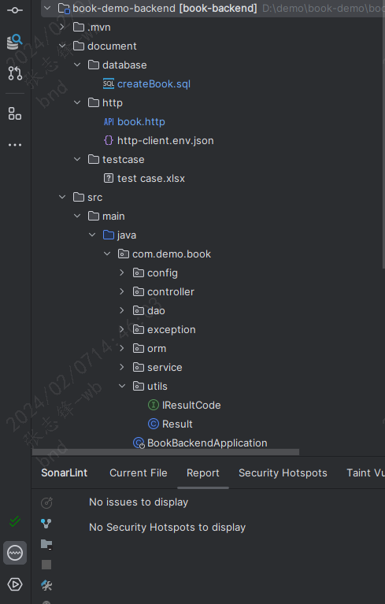
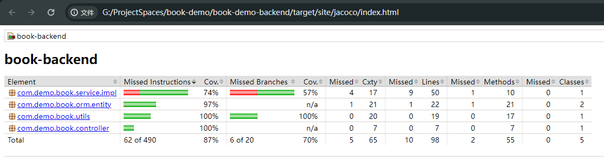

## Development mode

TDD: Through the test-driven development mode to complete the development of this project.
Test case documentation：document/testcase/test case.xlsx

## Development ideas

#### 1. consider safety

* Use Checkmarx to check whether the package is safe
* In order to prevent the self-increasing ID from being probed, it will be encrypted (To be processed)
* For security, it is necessary to encrypt the configuration file and add Nacos for dynamic configuration (To be processed)

#### 2. code quality

Check the quality of code with sonar

* Check the code specification with the alibaba java coding guidelines tool
* Writing unit tests
* Use Jacoco to check coverage
  
  There is no time to solve the mock problem of Specification yet, so the coverage rate has not reached 100%.
* Use httpClient tool or postman tool to check the interface

#### 3. The principle of development is to make the code as concise and efficient as possible

* Use unified exception code to throw errors and reduce the use of try and catch
* Unified log processing
* Use traceId to track log location problems

#### 4. Performance considerations

* I will establish the corresponding index when designing the database
* Add redis to cache data
* Use skyWalking and add sql monitoring
* Use Jmeter for stress test
* When problems arise, use Arthas to troubleshoot the problems

(There is no requirement for data and performance in this development, so I didn't add relevant processing.)

## Setup and deploy

* JDK：21
* tools：IntelliJ IDEA
* maven: 3.9.6
* CI/CD：Automated deployment through docker+Jenkins+Git+Harbor (To be processed)
